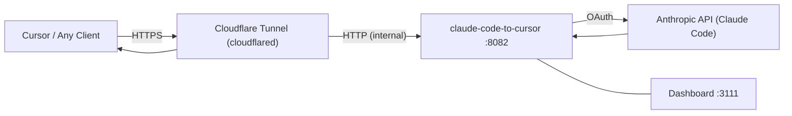

# claude-code-to-cursor

A proxy that routes API requests through Claude Code's OAuth authentication. It lets you use Claude in clients like **Cursor**, **VS Code**, or any OpenAI/Anthropic-compatible tool — without needing a direct Anthropic API key.

All traffic goes through a **Cloudflare Tunnel**, so claude-code-to-cursor is never directly exposed to the internet.

---

## Prerequisites

- [Bun](https://bun.sh) v1.0+ (or Docker)
- An Anthropic account with Claude Code access
- A **Cloudflare Tunnel** token ([create one here](https://developers.cloudflare.com/cloudflare-one/connections/connect-networks/get-started/create-remote-tunnel/))
- A client that supports OpenAI or Anthropic API format (e.g. Cursor)

## Quick Start

### Option A: Docker (recommended)

```bash
cp .env.example .env
# Edit .env and set CLOUDFLARE_TUNNEL_TOKEN

docker compose up -d
```

This starts three services:

- **api** — the proxy on port `8082` (internal)
- **frontend** — the dashboard on port `3111`
- **cloudflared** — the Cloudflare Tunnel that exposes the proxy

### Option B: Run locally with Bun

```bash
# Clone and install
git clone <repo-url> && cd claude-code-to-cursor
bun install

# Copy the example config and set your tunnel token
cp .env.example .env
# Edit .env and set CLOUDFLARE_TUNNEL_TOKEN

# Start the proxy (you still need cloudflared running separately)
bun run dev
```

> When running locally, you must run `cloudflared` yourself to establish the tunnel.

---

## Authenticate

claude-code-to-cursor uses Claude Code's OAuth flow. Open the dashboard and navigate to the **Auth** page:

1. Click **Initialize** to start the OAuth flow
2. Open the Anthropic link in your browser and approve access
3. Copy the authorization code and paste it back in the dashboard
4. The health indicator should turn green (**Online**)

Tokens auto-refresh. You only need to do this once (or when tokens expire).

---

## Configure Your Client

Point your client to your Cloudflare Tunnel URL. The API key can be any non-empty string (e.g. `sk-cctc`) — authentication is handled by OAuth.

### Cursor

Open Cursor settings and configure a custom model:


| Setting      | Value                                            |
| ------------ | ------------------------------------------------ |
| **Base URL** | `https://<your-tunnel>.cfargotunnel.com/v1`      |
| **API Key**  | `sk-cctc` (any non-empty string)                 |
| **Model**    | `claude-sonnet-4-20250514` (or any Claude model) |


claude-code-to-cursor exposes two compatible endpoints:

- **OpenAI format**: `POST /v1/chat/completions`
- **Anthropic format**: `POST /v1/messages`

### Other clients

Any client that supports a custom OpenAI-compatible base URL will work. Set the base URL to `https://<your-tunnel>.cfargotunnel.com/v1` and use any API key value.

---

## Verify It Works

Send a test request through your tunnel:

```bash
curl https://<your-tunnel>.cfargotunnel.com/v1/chat/completions \
  -H "Content-Type: application/json" \
  -H "Authorization: Bearer sk-cctc" \
  -d '{
    "model": "claude-sonnet-4-20250514",
    "messages": [{"role": "user", "content": "Hello!"}]
  }'
```

Or simply start using Claude in your client. The **Analytics** tab in the dashboard will show requests flowing through.

---

## Configuration Reference

All settings are in `.env`. See `[.env.example](.env.example)` for the full list.


| Variable                        | Default                       | Description                                 |
| ------------------------------- | ----------------------------- | ------------------------------------------- |
| `CLOUDFLARE_TUNNEL_TOKEN`       | *(required)*                  | Cloudflare Tunnel token                     |
| `PORT`                          | `8082`                        | Proxy server port (internal)                |
| `ALLOWED_IPS`                   | Cursor backend IPs            | IP whitelist (`disabled` to allow all)      |
| `CLAUDE_CODE_EXTRA_INSTRUCTION` | *(empty)*                     | Extra instruction appended to system prompt |
| `CCTC_AUTH_DIR`                 | `~/.cctc` / `/data/auth`      | OAuth credentials storage                   |
| `CCTC_DB_PATH`                  | `./cctc.db` / `/data/cctc.db` | SQLite database path                        |
| `SETTINGS_API_KEY`              | *(empty)*                     | Shared secret for settings API              |
| `FRONTEND_PORT`                 | `3111`                        | Dashboard frontend port                     |


---

## Architecture Overview




The proxy intercepts API requests, authenticates them via Claude Code OAuth, and forwards them to Anthropic. The Cloudflare Tunnel ensures the proxy is only reachable through Cloudflare's network. The dashboard provides real-time analytics, model settings, and authentication management.

---

## Troubleshooting

**Health indicator shows "Unauthenticated"**
→ Navigate to the Auth page and complete the OAuth flow.

**Health indicator shows "Offline"**
→ The API server isn't running. Check `docker compose logs api`.

**Requests fail with 403**
→ The requesting IP is not in `ALLOWED_IPS`. Check the logs or set `ALLOWED_IPS=disabled` in `.env`.

**Requests fail with 429**
→ You've hit Claude Code's rate limit. The dashboard shows when the limit resets.

**Tunnel not connecting**
→ Verify `CLOUDFLARE_TUNNEL_TOKEN` is set correctly in `.env`. Check `docker compose logs cloudflared` for errors.