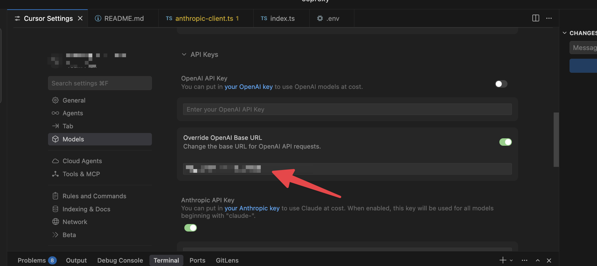

# ccproxy

A local proxy that routes Anthropic API requests through your Claude Code subscription, with automatic fallback to direct API when limits are hit.

> **⚠️ Disclaimer**: This proxy approach is hacky and may violate Anthropic's terms of service for Claude Code. Use at your own risk. No guarantees are provided.



## Quick Start

```bash
# Prerequisites: Claude Code CLI authenticated (`claude /login`) and Bun installed
bun install && bun run index.ts
```

Proxy runs on `http://localhost:8082`. Use `http://localhost:8082/v1` as your base URL.

### HTTPS via Cloudflare Tunnel

Cursor calls the API via their backend servers, so you need an HTTPS endpoint they can reach. Use Cloudflare Tunnel (or ngrok if you have it):

```bash
brew install cloudflared

# Quick tunnel (URL changes on restart)
cloudflared tunnel --url http://localhost:8082

# Fixed tunnel (permanent URL)
cloudflared tunnel login
cloudflared tunnel create ccproxy
cloudflared tunnel route dns ccproxy ccproxy.yourdomain.com
```

Create `~/.cloudflared/config.yml`:

```yaml
tunnel: <tunnel-id>
credentials-file: /Users/you/.cloudflared/<tunnel-id>.json

ingress:
  - hostname: ccproxy.yourdomain.com
    service: http://localhost:8082
  - service: http_status:404
```

Run: `cloudflared tunnel run ccproxy`

Use `https://ccproxy.yourdomain.com/v1` as your base URL.

> **⚠️ Security Warning**: Even though we whitelist Cursor's IP addresses, treat your tunnel URL like an API key. If it leaks, someone could use your Claude Code subscription and you could lose money on inference costs.

## Cursor Setup

In Cursor Settings, set the **Override OpenAI Base URL** to your Cloudflare tunnel URL (e.g., `https://ccproxy.yourdomain.com/v1`). Cursor will call our OpenAI-compatible endpoint, which translates requests to Claude.

> **Note**: The base URL override in Cursor can be finicky. If it's not working, try restarting Cursor or toggling the setting off and on.

### Caveats

This is not a 1:1 replacement for using the Anthropic API key directly in Cursor:

- **No thinking budget control** – We don't set the thinking budget that Cursor might otherwise configure
- **Missing beta features** – Some Anthropic beta headers/features are not forwarded
- **Tool call translation** – OpenAI tool calls are translated to Claude's format, which may have edge cases

## Configuration

| Variable            | Default | Description                                  |
| ------------------- | ------- | -------------------------------------------- |
| `PORT`              | `8082`  | Proxy port                                   |
| `ANTHROPIC_API_KEY` | -       | Fallback API key when Claude Code limits hit |
| `CLAUDE_CODE_FIRST` | `true`  | Set `false` to use direct API only           |

## How It Works

```
Cursor → ccproxy → Claude Code OAuth (subscription)
              ↓ fallback (429/403)
         Anthropic API (direct, paid)
```

Request metadata is logged to your local SQLite database for analytics and cost tracking.

## Analytics

Track your usage and estimated savings with the built-in analytics:

```bash
# Get usage for the last 24 hours (default)
curl http://localhost:8082/analytics

# Get usage for different periods
curl http://localhost:8082/analytics?period=hour
curl http://localhost:8082/analytics?period=week
curl http://localhost:8082/analytics?period=month
curl http://localhost:8082/analytics?period=all
```

Example response:

```json
{
  "period": "day",
  "totalRequests": 129,
  "claudeCodeRequests": 60,
  "apiKeyRequests": 69,
  "errorRequests": 0,
  "totalInputTokens": 163,
  "totalOutputTokens": 47,
  "estimatedApiKeyCost": 0,
  "estimatedSavings": 0.001194,
  "estimatedApiKeyCostFormatted": "$0.0000¢",
  "estimatedSavingsFormatted": "$0.1194¢",
  "note": "Costs are estimates. Actual costs may be lower due to prompt caching."
}
```

- **claudeCodeRequests** – Requests served via your Claude Code subscription (free)
- **apiKeyRequests** – Requests that fell back to your API key (paid)
- **estimatedSavings** – What you would have paid if all Claude Code requests went through the API

You can also view recent individual requests:

```bash
curl http://localhost:8082/analytics/requests?limit=10
```

## API Endpoints

| Endpoint               | Description                                         |
| ---------------------- | --------------------------------------------------- |
| `/v1/messages`         | Anthropic Messages API                              |
| `/v1/chat/completions` | OpenAI Chat Completions API                         |
| `/analytics`           | Usage stats (`?period=hour\|day\|week\|month\|all`) |
| `/analytics/requests`  | Recent individual requests (`?limit=100`)           |
| `/analytics/reset`     | Reset analytics (POST)                              |
| `/budget`              | GET/POST budget settings                            |
| `/health`              | Health check                                        |

## Troubleshooting

| Issue                | Fix                                                                               |
| -------------------- | --------------------------------------------------------------------------------- |
| No credentials found | Run `claude /login`                                                               |
| Token invalid        | Run `claude /login` again                                                         |
| Always falling back  | Check subscription limits, view `/analytics`                                      |
| Budget exceeded      | Wait for reset, increase via `POST /budget`, or disable with `{"enabled": false}` |

## License

MIT
